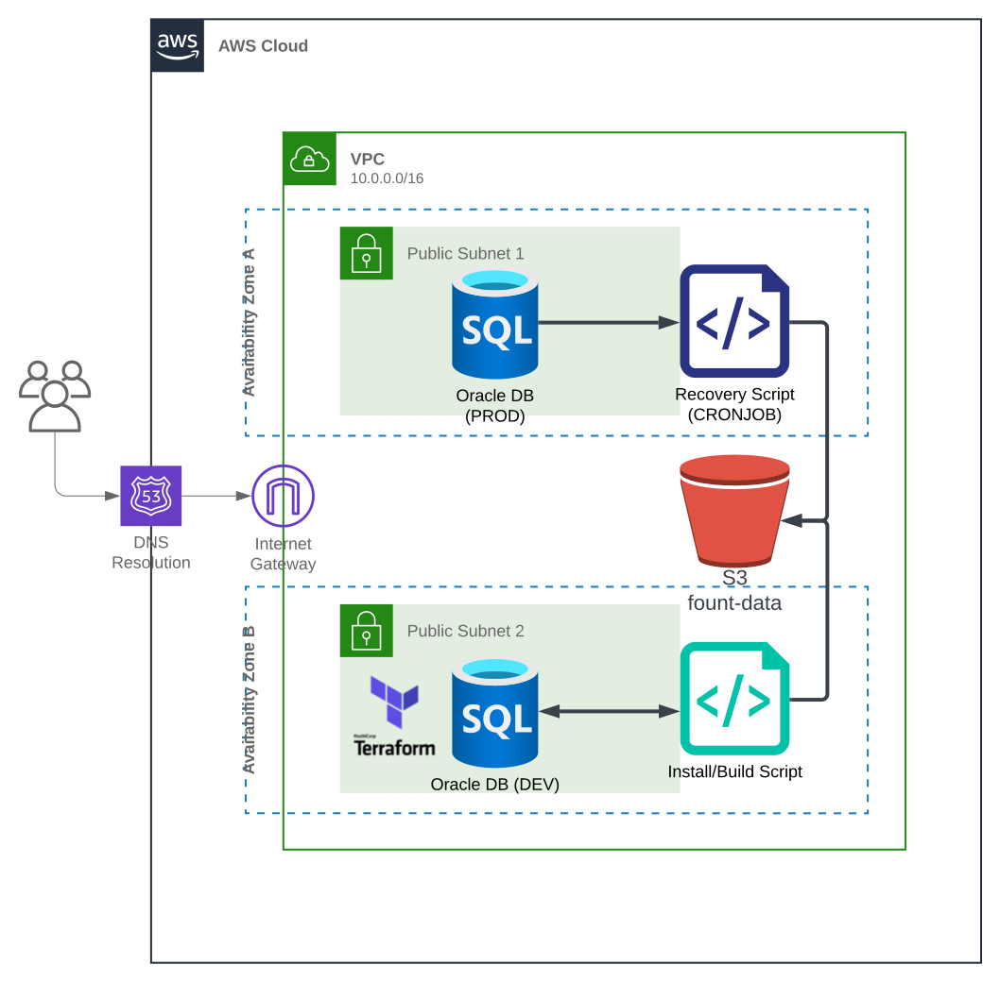

# terraform-oracle-install

### Overview

This Terraform script creates a development environment in AWS. It creates an EC2 instance and sets up the necessary IAM policies and roles to allow the instance to interact with an S3 bucket. The `oracle_install.sh` script installs and configures Oracle 19c on a Linux machine and copies required files from Amazon S3. The script sets the environment variables and aliases required to run Oracle.

#### Requirements

- A Linux machine with yum package manager installed
- Amazon S3 access to download the required files
- Terraform CLI

#### AWS IAM Role and Policy

The Terraform script creates an IAM role `ec2_role_ortest` with an assume role policy that allows EC2 instances to assume the role. This role is then associated with an IAM instance profile `ec2_profile_ortest`. A role policy is also created that grants the role the necessary permissions to perform actions on the S3 bucket "fount-data". The policy allows for getting objects and listing the bucket contents, as well as putting objects, object tags, and object version tags.

#### AWS EC2 Instance

The Terraform script creates an EC2 instance with the specified AMI, instance type, and subnet. The instance's root block device is also specified with a volume size and type. The instance is also configured to be EBS optimized. Provisioning is performed on the EC2 instance using a bash script. The script is copied to the instance, made executable, and then executed. The instance is also associated with the previously created IAM instance profile. The EC2 instance is part of a VPC with the specified security group, and is tagged with relevant metadata such as application name and environment.

#### `oracle_install.sh` Script

The following variables are used in the script:

- `ORACLE_HOME` - The path where Oracle 19c is installed
- `TMP_HOME` - Temporary home directory for Oracle
- `BACKUP` - Backup directory for RMAN backups
- `ORA_DATA` - The directory where the Oracle datafiles are stored
- `S3B` - S3 bucket location for RMAN backups
- `AWS` - Path to the AWS CLI executable
- `PINPOINT` - Pinpoint library
- `FILE_NAME` - Name of the reindex file
- `LICENSE` - Oracle license code

#### Installation

The script performs the following steps to install and configure Oracle:

- Installs required packages using yum: yum-utils, oracle-database-preinstall-19c, epel-release, jq, and rlwrap.
- Downloads and installs the AWS CLI.
- Creates a .bash_profile file in the temporary home directory for Oracle with environment variables, path, and aliases required to run Oracle.
- Copies the required files from Amazon S3: LINUX.X64_193000_db_home.zip, oracle_silent_install, tnsnames.ora, listener.ora, and libpinpoint_lnx_64_2.4.so.
- Changes the ownership and permissions of the required files.
- Installs Oracle 19c as the Oracle user using the silent install script.
- Configures and changes the ownership of Oracle after installation.

#### Schematic of RMAN backup/recovery on EC2

#### Conclusion

This Terraform script creates a development environment in AWS, including an EC2 instance with necessary IAM policies and roles, and provisioning for a bash script. The resulting environment is ready for use for development activities with AWS services. The `install_oracle.sh` script automates the installation and configuration of Oracle 19c on a Linux machine, making it easier and faster to set up the environment.
